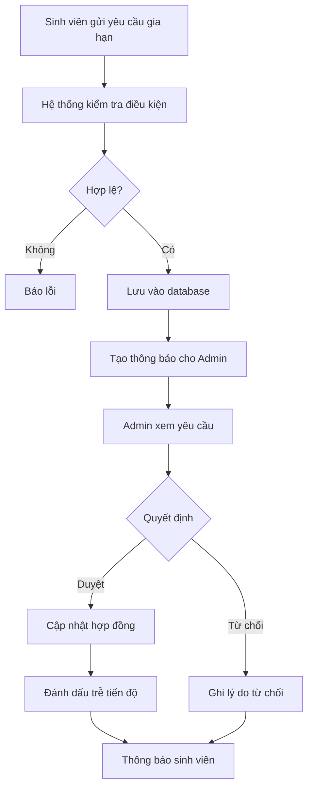

# 🕐 Hệ thống Gia hạn Đề tài Nghiên cứu

## 📋 Tổng quan

Hệ thống gia hạn đề tài nghiên cứu cho phép sinh viên yêu cầu gia hạn thời gian thực hiện đề tài và quản lý NCKH duyệt/từ chối các yêu cầu này. Các đề tài được gia hạn sẽ được đánh dấu là "trễ tiến độ".

## 🏗️ Kiến trúc hệ thống

### 1. Cơ sở dữ liệu

#### Bảng chính:
- **`de_tai_gia_han`**: Lưu trữ các yêu cầu gia hạn
- **`lich_su_gia_han`**: Audit log các thao tác gia hạn
- **`de_tai_nghien_cuu`**: Thêm cột `DT_TRE_TIENDO` và `DT_SO_LAN_GIA_HAN`

#### Views:
- **`v_de_tai_gia_han_summary`**: Tổng hợp thông tin gia hạn
- **`v_thong_ke_gia_han`**: Thống kê gia hạn theo khoa/năm

#### Stored Procedures:
- **`sp_approve_extension`**: Duyệt yêu cầu gia hạn
- **`sp_reject_extension`**: Từ chối yêu cầu gia hạn

#### Triggers:
- **`tr_de_tai_gia_han_after_insert`**: Ghi log khi tạo yêu cầu
- **`tr_de_tai_gia_han_after_update`**: Ghi log khi cập nhật
- **`tr_notify_extension_request`**: Tạo thông báo tự động

### 2. Giao diện người dùng

#### Dành cho Sinh viên:
- **`view/student/manage_extensions.php`**: Trang quản lý gia hạn
- **`view/student/process_extension_request.php`**: API xử lý yêu cầu
- **`view/student/get_extension_detail.php`**: Chi tiết yêu cầu
- **`view/student/cancel_extension.php`**: Hủy yêu cầu

#### Dành cho Research Admin:
- **`view/research/manage_extensions.php`**: Trang quản lý gia hạn
- **`view/research/get_extension_detail_admin.php`**: Chi tiết cho admin

#### Tích hợp Menu:
- Thêm menu "Gia hạn đề tài" vào sidebar sinh viên
- Thêm menu "Quản lý gia hạn" vào sidebar research admin với badge thông báo

## 🚀 Tính năng chính

### 1. Cho Sinh viên:
- ✅ Xem danh sách đề tài có thể gia hạn
- ✅ Yêu cầu gia hạn với lý do chi tiết
- ✅ Đính kèm file hỗ trợ (PDF, Word, hình ảnh)
- ✅ Theo dõi trạng thái yêu cầu
- ✅ Xem lịch sử gia hạn
- ✅ Hủy yêu cầu đang chờ duyệt
- ✅ Cảnh báo deadline gần hết hạn

### 2. Cho Quản lý NCKH:
- ✅ Xem tất cả yêu cầu gia hạn
- ✅ Lọc theo trạng thái, khoa, tìm kiếm
- ✅ Duyệt/từ chối yêu cầu với ghi chú
- ✅ Xem chi tiết thông tin sinh viên và đề tài
- ✅ Thống kê tổng quan
- ✅ Cảnh báo yêu cầu quá hạn xử lý
- ✅ Thông báo real-time

### 3. Quản lý trạng thái:
- ✅ Tự động đánh dấu đề tài trễ tiến độ
- ✅ Cập nhật ngày kết thúc hợp đồng
- ✅ Theo dõi số lần gia hạn
- ✅ Giới hạn tối đa 3 lần gia hạn

## 📊 Quy trình hoạt động



## 🛠️ Cài đặt và Triển khai

### 1. Chạy script database:
```sql
mysql -u root ql_nckh < create_extension_system.sql
```

### 2. Cấu hình uploads directory:
```bash
mkdir uploads/extensions
chmod 755 uploads/extensions
```

### 3. Kiểm tra permissions:
- Sinh viên: Có thể truy cập các trang trong `view/student/`
- Research Admin: Có thể truy cập các trang trong `view/research/`

## 📋 Validation Rules

### Yêu cầu gia hạn:
- ✅ Chỉ đề tài "Đang thực hiện" hoặc "Chờ duyệt"
- ✅ Không có yêu cầu nào đang chờ duyệt
- ✅ Tối đa 3 lần gia hạn
- ✅ Lý do ít nhất 20 ký tự
- ✅ Gia hạn tối đa 6 tháng/lần
- ✅ File đính kèm tối đa 5MB

### File được hỗ trợ:
- 📄 PDF (.pdf)
- 📝 Word (.doc, .docx)
- 🖼️ Hình ảnh (.jpg, .jpeg, .png)

## 🎨 UI/UX Features

### Sinh viên:
- 📊 Dashboard thống kê trực quan
- 🎯 Cards hiển thị đề tài có thể gia hạn
- ⚠️ Cảnh báo deadline
- 📱 Responsive design
- 🔄 Auto-refresh trạng thái

### Research Admin:
- 📈 Thống kê tổng quan
- 🔍 Bộ lọc mạnh mẽ
- 📋 Danh sách với priority coding
- 🔔 Badge thông báo real-time
- 📄 Modal chi tiết đầy đủ

## 🚨 Xử lý lỗi

### Lỗi thường gặp:
1. **Foreign key constraint**: Kiểm tra dữ liệu sinh viên/đề tài tồn tại
2. **File upload**: Kiểm tra quyền thư mục uploads
3. **Session timeout**: Kiểm tra cấu hình session PHP
4. **Database connection**: Kiểm tra connect.php

### Debug:
- Kiểm tra log tại `logs/` directory
- Sử dụng browser developer tools
- Kiểm tra MySQL error logs

## 🔒 Bảo mật

### Implemented:
- ✅ Session-based authentication
- ✅ Role-based access control
- ✅ SQL injection protection (prepared statements)
- ✅ XSS protection (htmlspecialchars)
- ✅ File upload validation
- ✅ CSRF protection (form tokens)

### Best practices:
- 🔐 Validate tất cả input
- 🛡️ Sanitize output
- 📁 Giới hạn file upload
- 🚫 Không expose sensitive data

## 📈 Tối ưu hiệu suất

### Database:
- 📊 Index trên các cột thường query
- 🔄 Pagination cho danh sách lớn
- 💾 View để tối ưu join phức tạp
- ⚡ Stored procedure cho logic phức tạp

### Frontend:
- 🔄 AJAX loading
- 📱 Responsive images
- ⚡ CSS/JS minification
- 🎯 Lazy loading

## 🧪 Testing

### Kiểm tra chức năng:
1. Tạo yêu cầu gia hạn từ sinh viên
2. Duyệt/từ chối từ admin
3. Kiểm tra cập nhật trạng thái
4. Test validation rules
5. Test file upload
6. Test responsive design

### Test cases:
- ✅ Sinh viên có quyền yêu cầu
- ✅ Validation input
- ✅ File upload security
- ✅ Database transactions
- ✅ Email notifications (nếu có)

## 🔄 Maintenance

### Định kỳ:
- 🗑️ Cleanup file uploads cũ
- 📊 Archive dữ liệu cũ
- 🔍 Monitor performance
- 🔒 Update security patches

### Monitoring:
- 📈 Theo dõi số lượng yêu cầu
- ⏱️ Thời gian xử lý trung bình
- 📊 Tỷ lệ duyệt/từ chối
- 🎯 User satisfaction

## 📞 Support

### Liên hệ:
- 👨‍💻 Developer: [Your Name]
- 📧 Email: [your-email@domain.com]
- 📱 Phone: [your-phone]

### Documentation:
- 📖 API Documentation: `/docs/api.md`
- 🎥 Video tutorials: `/docs/videos/`
- ❓ FAQ: `/docs/faq.md`

---

## 📝 Changelog

### Version 1.0.0 (2025-01-27)
- ✨ Initial release
- 🎯 Core extension request functionality
- 👥 User role management
- 📊 Statistics and reporting
- 📱 Mobile responsive design

---

*© 2025 - Hệ thống Quản lý Nghiên cứu Khoa học*
